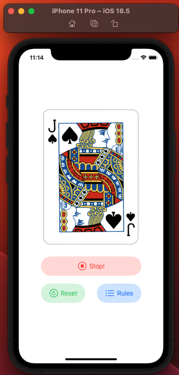
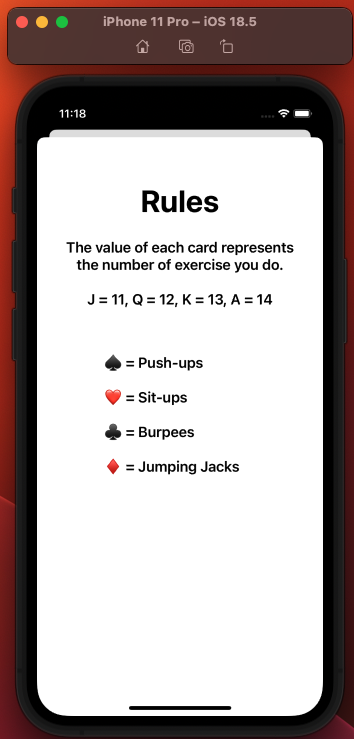

# CardWorkout

CardWorkout is a simple app that is part of <a href="https://www.youtube.com/@seanallen" target="_blank">Sean Allen's</a> course and introduces several concepts in iOS programming.
The app intends to you select a random card and do a exercise following the rules specified in the app.

# The App

